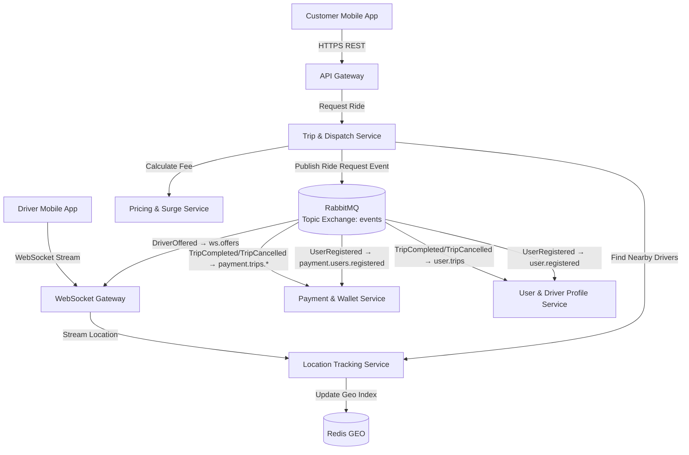

# Ride-Hailing & Logistics System

[](https://github.com/Cunos982003/IOC_PTH251125_BE105_LeTuanCuong_Project/actions/workflows/ci.yml)

## 🚀 Quick Start

```powershell
# 1. Clone repository
git clone https://github.com/Cunos982003/IOC_PTH251125_BE105_LeTuanCuong_Project.git
cd IOC_PTH251125_BE105_LeTuanCuong_Project

# 2. Sinh file .env (JWT_SECRET, INTERNAL_KEY, RABBITMQ_PASSWORD, mật khẩu DB/Redis)
.\scripts\gen-env.ps1

# 3. Build + chạy hạ tầng và toàn bộ 7 service
docker compose --profile apps up -d --build

# 4. Đợi service khởi động (~30-60s)
Start-Sleep -Seconds 30

# 5. Kiểm tra sức khỏe
curl http://localhost:8000/api/v1/health   # API Gateway
curl http://localhost:8001/api/v1/health   # WS Gateway
docker compose ps                          # Tất cả phải "healthy"

# 6. Chạy E2E test
.\tools\e2e\run-e2e.ps1
```

---

## 📚 Tài liệu

- **[Đề bài gốc](docs/DE-BAI.md)** - Yêu cầu đề tài R1-R16
- **[Build / Test / CI-CD / Deploy](BUILD-TEST-DEPLOY-GUIDE.md)** - Hướng dẫn chi tiết quy trình phát triển
- **[CI/CD Setup](CI-SETUP-COMPLETE.md)** - GitHub Actions pipeline
- **[E2E Testing](tools/e2e/README.md)** - Bộ test end-to-end
- **[Load Testing](tools/loadtest/README.md)** - Công cụ kiểm thử tải
- **[Contracts](docs/contracts/README.md)** - Hợp đồng giữa các service

---

## 1. HƯỚNG DẪN TỪNG BƯỚC: BUILD → TEST → CHẠY → DEPLOY

### 1.1. Yêu cầu môi trường

| Thành phần | Phiên bản |
|---|---|
| Java | 21 (Eclipse Temurin / OpenJDK) |
| Maven | 3.9+ |
| Docker | Engine 29.x (Docker Desktop) |
| Shell | PowerShell 5.1+ (Windows) |

### 1.2. Chuẩn bị biến môi trường (chỉ 1 lần)

```powershell
# Sinh .env với các secret ngẫu nhiên (KHÔNG ghi đè nếu đã có)
.\scripts\gen-env.ps1
```

`.env` chứa tối thiểu: `JWT_SECRET`, `INTERNAL_KEY`, `RABBITMQ_PASSWORD` (bắt buộc — thiếu thì service không khởi động), các mật khẩu DB (`*_DB_PASSWORD`), `REDIS_PASSWORD`, `CORS_ALLOWED_ORIGINS`, `IMAGE_TAG`.

### 1.3. Build (biên dịch)

```powershell
# Build tất cả module, bỏ qua test
mvn clean package -DskipTests

# Build một module cụ thể
mvn -pl user-service clean package -DskipTests
```

> Plugin Enforcer tự chạy mỗi lần build để cấm phụ thuộc cross-module (`com.ridehailing:*`). Vi phạm → build FAIL.

### 1.4. Test

```powershell
# Unit test toàn bộ
mvn test

# Unit test một module / một test class
mvn -pl dispatch-service test
mvn -pl dispatch-service test -Dtest=TripStateMachineTest

# Integration test (cần Docker đang chạy để khởi động Testcontainers)
mvn verify -DskipITs=false

# Kiểm tra hợp đồng giữa docs/contracts và bản copy trong mỗi service
.\scripts\check-contracts.ps1
```

### 1.5. Chạy hệ thống (Docker Compose)

**Profiles có sẵn:** `apps` (7 service), `ha` (replica ws-gateway thứ 2)

```powershell
# Chỉ hạ tầng (Postgres + Redis + RabbitMQ)
docker compose up -d

# Toàn bộ 7 service (kèm hạ tầng), build image tại chỗ
docker compose --profile apps up -d --build

# Thêm replica ws-gateway thứ 2 (tùy chọn, profile ha)
docker compose --profile apps --profile ha up -d --build

# Xem trạng thái / logs
docker compose ps
docker compose logs -f api-gateway
docker compose logs -f dispatch-service
```

**Danh sách service & cổng:**

| Service | Cổng | DB |
|---|---|---|
| api-gateway | 8000 | — |
| ws-gateway | 8001 | — |
| user-service | 8081 | user |
| location-service | 8082 | location |
| dispatch-service | 8083 | dispatch |
| pricing-service | 8084 | — (chỉ Redis) |
| payment-service | 8085 | payment |

> Chỉ `api-gateway` (8000) và `ws-gateway` (8001) bind cổng ra host (127.0.0.1).
> Các service nội bộ chỉ giao tiếp qua mạng Docker, không mở ra ngoài.
> **RabbitMQ (5672) dùng cho event bus nội bộ** — không expose ra ngoài.

**Kiểm tra sức khỏe:**

```powershell
curl http://localhost:8000/api/v1/health
curl http://localhost:8001/api/v1/health
```

**Dừng / dọn dẹp:**

```powershell
# Dừng service, giữ lại hạ tầng
docker compose --profile apps stop

# Dừng tất cả, giữ volume dữ liệu
docker compose --profile apps down

# Xóa cả volume (mất toàn bộ dữ liệu)
docker compose --profile apps down -v
```

### 1.6. E2E test

```powershell
# Yêu cầu: hệ thống đã chạy (docker compose --profile apps up -d)
.\tools\e2e\run-e2e.ps1
```

4 kịch bản: Happy Path, No Driver Found, Cancellation, Insufficient Balance.

### 1.7. Load test

```powershell
cd tools\loadtest
pip install websockets httpx

python prepare.py 100                             # Đăng ký 100 tài xế → tokens.json
python drivers.py --drivers 100 --duration 300    # Giả lập gửi GPS
python latency.py --duration 300                  # Đo độ trễ (terminal khác)
```

### 1.8. Deploy lên VPS

Xem chi tiết ở [mục 5](#5-hướng-dẫn-triển-khai-lên-server-vps-thực-tế).

---

## 2. TỔNG QUAN VỀ ĐỀ TÀI

- **Tên đề tài:** Thiết kế và phát triển hệ thống Đặt xe & Giao hàng thời gian thực (mô hình Grab/Gojek) trên kiến trúc Microservices.
- **Mô tả:** Hệ thống quản lý kết nối giữa Khách hàng (Passenger/Customer) và Tài xế (Driver), định vị vị trí thời gian thực (Real-time GPS Tracking), tính toán cước phí linh hoạt (Surge Pricing) và ghép nối chuyến xe thông minh (Matching Engine).
- **Tính thực tế doanh nghiệp:**
    - Xử lý hàng trăm ngàn tọa độ GPS gửi lên mỗi giây từ ứng dụng của tài xế.
    - Đòi hỏi độ trễ cực thấp trong việc ghép nối tài xế gần nhất với khách hàng.
    - Phân tách service giúp đảm bảo nếu tính năng tính cước/khuyến mãi bị quá tải, hệ thống định vị tài xế vẫn hoạt động ổn định.

---

## 3. PHÂN TÍCH KIẾN TRÚC MICROSERVICES

### 3.1. Danh sách các Microservices chính

1. **API Gateway & WebSocket Gateway:**
    - Quản lý kết nối HTTP REST và kết nối WebSocket persistent hai chiều với ứng dụng tài xế & khách hàng.
2. **User & Driver Profile Service:**
    - Quản lý tài khoản khách hàng, hồ sơ tài xế, thông tin xe, bằng lái, trạng thái hoạt động (Online/Offline/Busy).
3. **Location & Telemetry Tracking Service (High Throughput Service):**
    - Tiếp nhận stream tọa độ GPS từ ứng dụng tài xế gửi lên theo chu kỳ 3-5 giây/lần.
    - Lưu trữ và cập nhật vị trí mới nhất của tài xế để hỗ trợ truy vấn không gian (Spatial Queries).
    - **Redis GEO cho truy vấn vị trí thời gian thực; PostGIS: chưa triển khai** (xem F3).
4. **Trip & Dispatching Matching Service (Core Engine):**
    - Nhận yêu cầu đặt xe từ khách hàng -> Tìm kiếm tài xế phù hợp xung quanh bán kính X km -> Gửi đề nghị nhận chuyến tới tài xế.
    - Quản lý trạng thái chuyến đi (CREATED, MATCHING, ACCEPTED, PICKING_UP, IN_TRIP, COMPLETED, CANCELLED, NO_DRIVER_FOUND).
5. **Dynamic Pricing & Surge Fee Service:**
    - Tính toán giá tiền dựa trên khoảng cách, thời gian dự kiến và hệ số nhân nhu cầu (Surge Pricing).
    - **Haversine × 1.3 làm fallback**; OSRM integration: xem F4.
6. **Payment & Wallet Service:**
    - Quản lý ví điện tử tài xế, trừ hoa hồng chuyến đi, thanh toán cho khách hàng.

### 3.2. Sơ đồ kiến trúc & Cơ chế giao tiếp (Inter-Service Communication)



- **Truyền nhận dữ liệu thời gian thực (Real-time Streaming):**
    - **WebSocket:** Giữ kết nối liên tục giữa Driver App và `ws-gateway`.
- **Event-Driven Architecture (RabbitMQ Topic Exchange + Outbox Pattern):**
    - **Exchange:** `events` (topic), có Dead Letter Exchange `events.dlx` cho DLQ.
    - **Outbox Pattern:** Mỗi service ghi event vào bảng `outbox` cùng transaction DB, sau đó `OutboxWorker` publish lên RabbitMQ với **publisher confirms (correlated)** + `mandatory=true`. Chỉ đánh dấu `sent=true` sau khi broker ACK.
    - **Consumer:** `@RabbitListener` với `autoStartup=true` (mặc định), idempotent (INSERT ... ON CONFLICT DO NOTHING), retry 3 lần (exponential backoff) rồi reject không requeue → DLQ.
    - **Routing keys / Queues:**
        - `users.registered` → `user.registered`, `payment.users.registered`
        - `trips.offered` → `ws.offers`
        - `trips.completed` / `trips.cancelled` → `payment.trips.completed`, `payment.trips.cancelled`, `user.trips`
    - **Không dùng Redis Streams.** RabbitMQ đảm bảo at-least-once delivery; consumer **bắt buộc idempotent**.
- **Virtual threads:** Đã bật (`spring.threads.virtual.enabled=true` trong mọi `application.yml`).

---

## 4. BẢNG: ĐỀ YÊU CẦU / ĐÃ LÀM / KHÁC BIỆT

| Đề yêu cầu (R1-R16) | Đã làm | Khác biệt & Lý do |
|---|---|---|
| **R1** Real-time < 500ms | ✅ WebSocket + Redis Pub/Sub | Đo thực tế qua `tools/evidence/latency_e2e.py` |
| **R2** Matching Accuracy | ✅ MatchingService + disp:lock | Test `match_accuracy.py` xác nhận tài xế gần nhất nhận offer trước |
| **R3** 7 Microservices | ✅ 7 service độc lập | Không module common, mỗi service tự đủ |
| **R4** Customer Web App | ✅ `web/index.html` (Leaflet) | Single file, no build, deploy qua Nginx `/var/www/ride` |
| **R5** Redis GEOSEARCH < 2ms | ✅ `GEOSEARCH` Lua script | Benchmark `bench_geo.py` (Redis local & qua HTTP) |
| **R6** WS Failover 2 replica | ✅ Profile `ha`, reconnect backoff | Test `failover_ws.ps1` đo thời gian reconnect |
| **R7** State Machine | ✅ TripStatus enum + transition | Có CANCELLED, NO_DRIVER_FOUND |
| **R8** Surge Pricing | ✅ Geohash grid, demand/supply | Đề ghi ngược supply/demand → code dùng demand=yêu cầu, supply=tài xế rảnh |
| **R9** PostGIS | ❌ Chưa | Redis GEO cho real-time; PostGIS migration: F3 |
| **R10** OSRM | ❌ Chưa | Dùng Haversine × 1.3; OSRM integration: F4 |
| **R11** Payment & Wallet | ✅ WalletService, Settlement | Ví điện tử, hoa hồng 20% mặc định |
| **R12** Outbox + RabbitMQ | ✅ OutboxWorker, publisher confirm | DLX `events.dlx`, retry 3 lần + DLQ |
| **R13** Internal API | ✅ X-Internal-Key, timeout 500ms-2s | Không retry vô hạn |
| **R14** CI/CD | ✅ Test/contracts xanh, build image | Push image GHCR, deploy SSH: F6 |
| **R15** Load Test | ✅ `tools/loadtest/drivers.py` | 100 driver ảo, đo latency |
| **R16** Báo cáo & Demo | ✅ `docs/BAO-CAO.md`, `docs/DEMO-SCRIPT.md` | F7 |

**Tóm tắt khác biệt chính:**
- **Broker:** RabbitMQ (topic exchange `events` + DLX) thay vì Apache Kafka + Zookeeper
- **Trạng thái Busy:** Lưu ở `location-service` (Redis `loc:driver:{id}`) thay vì user-service
- **Supply/Demand:** Đề bài ghi ngược; code dùng `demand = số yêu cầu đặt xe`, `supply = số tài xế rảnh`
- **OSRM:** Chưa tích hợp, dùng Haversine × 1.3 fallback
- **PostGIS:** Chưa triển khai, dùng Redis GEO cho real-time
- **Thanh toán thẻ:** Chưa có (chỉ ví nội bộ)
- **HA:** Chỉ `ws-gateway` có 2 replica (profile `ha`)

---

## 5. HƯỚNG DẪN TRIỂN KHAI LÊN SERVER VPS THỰC TẾ

### Step 1: Chuẩn bị Hạ tầng VPS
- **Cấu hình tối thiểu đề xuất:** Cloud VPS (Ubuntu 22.04 LTS, 4 vCPU, 8GB RAM, SSD 60GB).
- **Yêu cầu kết nối mạng:** VPS cần có IP Tĩnh Public (Elastic IP) và độ trễ thấp.

### Step 2: Cài Docker và clone mã nguồn
```bash
ssh user@your-vps-ip

# Cài Docker + Compose
curl -fsSL https://get.docker.com -o get-docker.sh
sudo sh get-docker.sh
sudo usermod -aG docker $USER
# Đăng nhập lại để áp dụng group docker

# Clone repository
git clone https://github.com/Cunos982003/IOC_PTH251125_BE105_LeTuanCuong_Project.git
cd IOC_PTH251125_BE105_LeTuanCuong_Project
```

### Step 3: Cấu hình secret (.env)
Trên VPS dùng Linux, tạo `.env` thủ công (đừng commit lên git):

```bash
cat > .env << 'EOF'
JWT_SECRET=$(openssl rand -base64 48)
INTERNAL_KEY=$(openssl rand -hex 32)
RABBITMQ_PASSWORD=$(openssl rand -hex 24)
POSTGRES_PASSWORD=$(openssl rand -hex 24)
USER_DB_PASSWORD=$(openssl rand -hex 24)
LOCATION_DB_PASSWORD=$(openssl rand -hex 24)
DISPATCH_DB_PASSWORD=$(openssl rand -hex 24)
PAYMENT_DB_PASSWORD=$(openssl rand -hex 24)
REDIS_PASSWORD=$(openssl rand -hex 24)
CORS_ALLOWED_ORIGINS=https://ridehailing.duckdns.org
IMAGE_TAG=latest
EOF
chmod 600 .env
```

> Lưu ý: mật khẩu Postgres/Redis chỉ có tác dụng khi volume còn trống (lần init đầu).

### Step 4: Tạo thư mục web app (chạy 1 lần)
```bash
sudo mkdir -p /var/www/ride && sudo chown deploy:deploy /var/www/ride
```

### Step 5: Chạy hệ thống
```bash
docker compose --profile apps up -d --build

# Kiểm tra sức khỏe
curl http://localhost:8000/api/v1/health
curl http://localhost:8001/api/v1/health
docker compose ps
```

### Step 6: Cấu hình Nginx Reverse Proxy cho WebSocket + Web App
Cấu hình Nginx trên VPS (`/etc/nginx/sites-available/ride-api`) — **không ghi đè file certbot**, chỉ thay thế khối `location /`:

```nginx
# Health check
location /health {
    access_log off;
    return 200 "OK\n";
    add_header Content-Type text/plain;
}

# Serve customer web app
location / {
    root /var/www/ride;
    index index.html;
    try_files $uri $uri/ =404;
}
```

Sau đó:
```bash
sudo nginx -t && sudo systemctl reload nginx
```

### Step 7: Triển khai SSL & HTTPS với Certbot
```bash
sudo apt install certbot python3-certbot-nginx
sudo certbot --nginx -d ridehailing.duckdns.org
sudo certbot renew --dry-run
```

### Step 8: Cập nhật dịch vụ (Rolling Update)
```bash
docker compose --profile apps up -d --no-deps --build user-service
docker compose ps
```

### Step 9: Deploy tự động bằng script
```bash
# Sinh .env nếu thiếu → pull code → pull image GHCR → cập nhật lần lượt từng service
./scripts/deploy.sh
```

### Step 10: Tự động hoá CI/CD (GitHub Actions)
Pipeline CI (`.github/workflows/ci.yml`) chạy test, kiểm tra hợp đồng và build 7 image (`push: false`, chỉ verify build). Job deploy tự động qua SSH được mô tả ở [BUILD-TEST-DEPLOY-GUIDE.md](BUILD-TEST-DEPLOY-GUIDE.md) và F6.

---

## 6. TIÊU CHÍ ĐÁNH GIÁ & YÊU CẦU BÀI LÀM CHO SINH VIÊN

1. **Tính thời gian thực (Real-time Performance):** Vị trí tài xế cập nhật liên tục và hiển thị mượt mà trên bản đồ khách hàng qua WebSocket với độ trễ < 500ms.
2. **Khả năng ghép chuyến (Matching Accuracy):** Hệ thống gửi tín hiệu đặt xe đến đúng tài xế đang rảnh và ở gần nhất.
3. **Triển khai VPS thực tế:** Chạy hệ thống trên VPS thực, kiểm tra kết nối SSL/WSS từ mạng ngoài thành công.
4. **Kịch bản Demo & Chịu tải:**
    - Viết script Python giả lập 100 tài xế di chuyển ảo và gửi tọa độ GPS liên tục lên VPS.
    - Thực hiện thao tác đặt xe từ ứng dụng khách hàng thực tế và kiểm tra tài xế ảo nhận được chuyến.