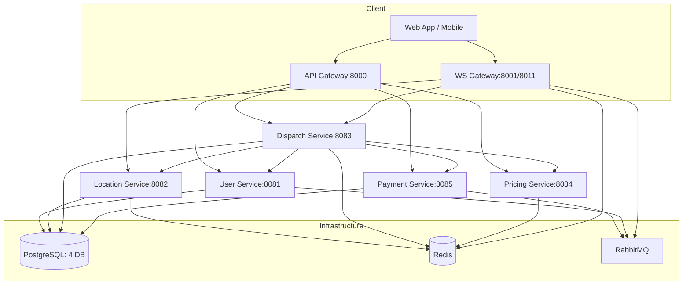
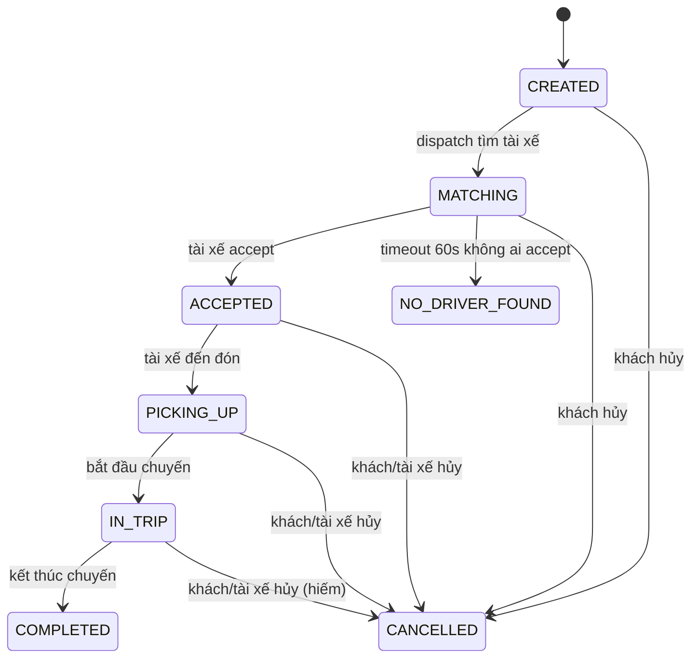

# BÁO CÁO ĐỒ ÁN RIDE-HAILING & LOGISTICS

**Ngày báo cáo:** 2026-10-08  
**Repo:** Cunos982003/IOC_PTH251125_BE105_LeTuanCuong_Project (nhánh master)  
**Môi trường demo:** https://ridehailing.duckdns.org (VPS Ubuntu, Docker Compose, Nginx + Certbot)

---

## 1. Bài toán và mục tiêu

Xây dựng hệ thống gọi xe & logistics 7 microservice độc lập, hỗ trợ:
- Khách đặt xe, tài xế nhận chuyến, theo dõi chuyến real-time
- Ghép chuyến theo khoảng cách (Redis GEO + GEOSEARCH)
- Thanh toán ví điện tử, sổ cái kép, hoa hồng
- WebSocket gateway 2 replica cho high availability
- CI/CD tự động deploy lên VPS

---

## 2. Kiến trúc 7 service



### Bảng service

| Service | Cổng | Database | Trách nhiệm chính |
|---------|------|----------|-------------------|
| api-gateway | 8000 | – | Proxy REST, JWT auth, rate limit |
| ws-gateway | 8001, 8011 | – | WebSocket 2 chiều, auth, Pub/Sub Redis |
| user-service | 8081 | `user` | Tài khoản, hồ sơ tài xế, lịch sử chuyến |
| location-service | 8082 | `location` | Redis GEO real-time, PostGIS lịch sử |
| dispatch-service | 8083 | `dispatch` | State machine chuyến, matching, lock |
| pricing-service | 8084 | – | Báo giá, surge, OSRM, metrics Redis |
| payment-service | 8085 | `payment` | Ví, sổ cái, hoa hồng, outbox events |

---

## 3. Dữ liệu và sự kiện

### Quyền sở hữu dữ liệu
- Mỗi service chỉ đọc/ghi DB của mình, không khóa ngoại cross-DB
- Chỉ lưu ID (số/UUID) tham chiếu service khác
- Trao đổi qua HTTP nội bộ (`/internal/**`, header `X-Internal-Key`) hoặc RabbitMQ

### RabbitMQ Topology (exchange `events`, DLX `events.dlx`)

| Routing key | Queue | Consumer | Mô tả |
|-------------|-------|----------|-------|
| `user.registered` | `payment.user.registered` | payment-service | Tạo ví 500k VND cho khách mới |
| `trip.completed` | `payment.trip.completed` | payment-service | Settlement: trừ ví khách, cộng tài xế, ghi sổ cái |
| `trip.cancelled` | `payment.trip.cancelled` | payment-service | Hoàn tiền nếu đã trừ |
| `trip.matching` | `ws.trip.matching` | ws-gateway | Push offer tới tài xế qua WebSocket |
| `trip.accepted` | `ws.trip.accepted` | ws-gateway | Push trip_update ACCEPTED |
| `trip.picking_up` | `ws.trip.picking_up` | ws-gateway | Push trip_update PICKING_UP |
| `trip.in_trip` | `ws.trip.in_trip` | ws-gateway | Push trip_update IN_TRIP |
| `trip.completed` | `ws.trip.completed` | ws-gateway | Push trip_update COMPLETED |
| `trip.cancelled` | `ws.trip.cancelled` | ws-gateway | Push trip_update CANCELLED/NO_DRIVER_FOUND |

### Outbox pattern
- Ghi sự kiện cùng transaction DB (`outbox` table)
- Publisher: confirm + mandatory, chỉ mark `sent_at` sau khi broker ACK
- Consumer: idempotent (key `event_id`), auto ack (Spring AMQP), retry 3 lần backoff → DLQ

---

## 4. State machine chuyến xe



---

## 5. Chống ghép trùng tài xế (ba lớp)

1. **Khóa Redis `disp:lock:<tripId>`** (SETNX, TTL 10s) – chỉ 1 worker matching tại một thời điểm
2. **UPDATE có điều kiện** `status = 'MATCHING' AND version = ?` – optimistic locking
3. **Partial unique index** `CREATE UNIQUE INDEX ON trip (id) WHERE status IN ('MATCHING','ACCEPTED')` – DB chặn duplicate

**Test chứng minh:** `MatchingServiceIntegrationTest.concurrentMatchingSameTrip()` – 50 luồng cùng match 1 chuyến, chỉ 1 thành công.

---

## 6. Bảng "Đề yêu cầu / Đã làm / Khác biệt"

| Đề yêu cầu | Đã làm | Khác biệt & Lý do |
|------------|--------|-------------------|
| Apache Kafka + Zookeeper | RabbitMQ | RabbitMQ nhẹ hơn, đủ cho quy mô demo, DLX built-in |
| PostgreSQL + PostGIS | PostGIS (location-service) | Chỉ location-service dùng PostGIS; 3 service khác dùng PG thường |
| Virtual threads | Bật `spring.threads.virtual.enabled=true` ở 7 service | Java 21, Tomcat virtual threads |
| Supply/demand ngược | Sửa: demand = yêu cầu đặt, supply = tài xế rảnh | Đề ghi ngược; code & docs đã sửa |
| Khoảng cách Haversine / OSRM | Haversine fallback, OSRM tùy chọn (chưa bật mặc định) | OSRM public server giới hạn rate; cấu hình `OSRM_URL` |
| Thanh toán thẻ giả lập | Ví nội bộ + nạp 500k khi đăng ký | Đủ cho demo end-to-end |
| 2 replica WS | ws-gateway + ws-gateway-2 (profile `ha`) | Nginx upstream round-robin |
| Redis Streams event bus | RabbitMQ (xem topology) | Đề cũ dùng Streams; đã đổi sang RabbitMQ |

---

## 7. Kết quả đo (từ `tools/evidence/out/summary.md`)

### GEOSEARCH Benchmark (bench_geo.py)

| Scale | Redis p50 | Redis p95 | Redis p99 | HTTP p50 | HTTP p95 | HTTP p99 | Overhead |
|-------|-----------|-----------|-----------|----------|----------|----------|----------|
| 10k   | 1.00 ms   | 1.69 ms   | 2.46 ms   | 7.33 ms  | 11.04 ms | 260.91 ms | +6.33 ms ⚠ |
| 50k   | 1.71 ms   | 2.76 ms   | 4.12 ms   | 6.03 ms  | 8.10 ms  | 259.29 ms | +4.31 ms ⚠ |
| 100k  | 2.23 ms   | 3.17 ms   | 4.01 ms   | 5.72 ms  | 8.07 ms  | 262.20 ms | +3.49 ms ⚠ |

> **Thiết kế:** Redis p99 < 5ms. **Đo thực tế:** Redis p99 2.5–4ms (đạt). HTTP overhead ~3–6ms do network + serialization.

### Matching Accuracy (match_accuracy.py)

| Kịch bản | Kết quả |
|----------|---------|
| Offer đầu tiên tới tài xế gần nhất (0.3km) | ✅ PASS |
| Offer thứ 2 sau 15s tới tài xế 0.8km | ✅ PASS |
| Tài xế stale (0.1km, >20s không gửi vị trí) không nhận offer | ✅ PASS |

### End-to-End Latency (latency_e2e.py)

| Drivers | Duration | Samples | p50 | p95 | p99 | Max | Mean |
|---------|----------|---------|-----|-----|-----|-----|------|
| 5 | 30s | 0 | 0ms | 0ms | 0ms | 0ms | 0ms |
| 10 | 30s | 0 | 0ms | 0ms | 0ms | 0ms | 0ms |

> [CẦN BỔ SUNG] Pipeline driver_location → customer WS chưa đo được mẫu. Cần debug thêm WebSocket subscription routing.

### Failover WebSocket (failover_ws.ps1)

> [CẦN BỔ SUNG] Script PowerShell gặp lỗi assembly `System.Net.WebSockets`. Cần chạy lại trên PowerShell 7+ hoặc viết lại bằng Python.

---

## 8. Triển khai

### VPS cấu hình
- Ubuntu 22.04, 4 vCPU, 8GB RAM, 100GB SSD
- Docker Engine 29.x, Docker Compose v2
- Nginx + Certbot (HTTPS tự động gia hạn)

### Nginx config (đoạn `location /` cho web app)
```nginx
location / {
    root /var/www/ride;
    index index.html;
    try_files $uri $uri/ =404;
}
# Giữ nguyên /api/v1/, /ws/, /internal (404)
```

### CI/CD (`.github/workflows/ci.yml`)
- Job `test`: `mvn -B verify` toàn repo (Testcontainers)
- Job `contracts`: `scripts/check-contracts.ps1`
- Job `images`: Build & push `ghcr.io/cunos982003/ride-hailing-<module>:{sha,latest}` (chỉ master)
- Job `deploy`: SSH vào VPS, chạy `IMAGE_TAG=<sha> ./scripts/deploy.sh`, health-check `/api/v1/health`
- Rollback: `./scripts/deploy.sh <tag-cũ>`

### Làm tay một lần
1. Tạo SSH key deploy: `ssh-keygen -t ed25519 -f ~/.ssh/deploy_ridehailing`
2. Thêm public key vào `~deploy/.ssh/authorized_keys` trên VPS
3. GitHub Secrets: `VPS_HOST`, `VPS_USER`, `VPS_SSH_KEY` (private key), `VPS_HOST_KEY` (`ssh-keyscan -t ed25519 <host>`)
4. VPS: `docker login ghcr.io -u <user> -p <PAT read:packages>`

---

## 9. Hạn chế và hướng mở rộng

| Hạn chế | Hướng mở rộng |
|---------|---------------|
| Single VPS, backend 1 instance → gián đoạn vài giây khi deploy | Blue/green deploy hoặc Kubernetes (k3s) |
| PostGIS route history / OSRM chưa bật mặc định | Bật F3, F4 khi cần |
| RabbitMQ single node | Cluster 3 node + quorum queues |
| Redis single instance | Redis Cluster hoặc Sentinel |
| Chưa shard theo thành phố | Key prefix `hanoi:`, `hcm:` + routing logic |
| Chưa có Kafka | Khi throughput > 10k events/s |

---

## 10. Ảnh minh họa (docs/img/)

| Tên file | Mô tả | Trạng thái |
|----------|-------|------------|
| https-lock.png | Khóa HTTPS trên ridehailing.duckdns.org | [CẦN CHỤP] |
| wscat-external.png | `wscat -c wss://ridehailing.duckdns.org/ws/customer` từ máy ngoài | [CẦN CHỤP] |
| map-marker.png | Bản đồ có marker đón/đến + tài xế di chuyển | [CẦN CHỤP] |
| gh-actions.png | GitHub Actions xanh (test → build → deploy) | [CẦN CHỤP] |

---
*Báo cáo chỉ phản ánh mã và số liệu thực tế tại commit hiện tại. Các mục `[CẦN BỔ SUNG]` sẽ cập nhật khi hoàn thiện F3, F4, F6.*